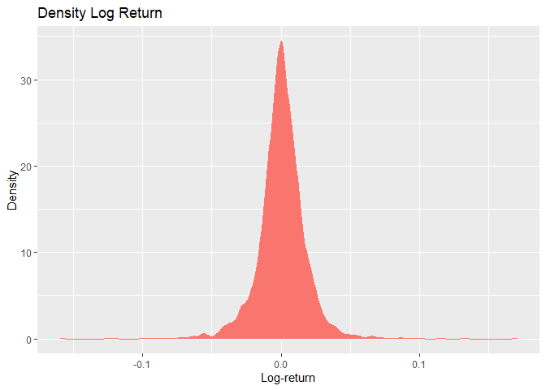

Shares price risk management with statistical approach
================
Ragdoll99
2022-09-26

## R Markdown

### This project is to showcase using statistical methods to analyze investment risk management in equity (in our case, Microsoft)

``` r
library(knitr)
library(quantmod)
library(tidyverse)
library(dplyr)
library(ggplot2)
msft <- getSymbols("MSFT",src="yahoo",auto.assign=FALSE)
msft <- data.frame(msft)
head(msft, 5)
```

    ##            MSFT.Open MSFT.High MSFT.Low MSFT.Close MSFT.Volume MSFT.Adjusted
    ## 2007-01-03     29.91     30.25    29.40      29.86    76935100      21.68802
    ## 2007-01-04     29.70     29.97    29.44      29.81    45774500      21.65170
    ## 2007-01-05     29.63     29.75    29.45      29.64    44607200      21.52823
    ## 2007-01-08     29.65     30.10    29.53      29.93    50220200      21.73887
    ## 2007-01-09     30.00     30.18    29.73      29.96    44636600      21.76066

Keep only the closing price for each day

``` r
msft_close <- dplyr::select(msft, "MSFT.Close")
tail(msft_close, 5)
```

    ##            MSFT.Close
    ## 2022-09-21     238.95
    ## 2022-09-22     240.98
    ## 2022-09-23     237.92
    ## 2022-09-26     237.45
    ## 2022-09-27     236.41

### Let calculate log return for each day.

log return is calculated by taking the natural log of the ending value
divided by the beginning value  
in time series analysis, we use log-return for each period because it is
time-additive/ time-consistence  
daily log return sum up will equal to period return, hence it is widely
used by finance professionals  

``` r
qplot(data = msft_close,y = MSFT.Close)+geom_line(color='darkgreen')
```

<!-- -->

``` r
msft_close <- as.matrix(msft_close)
logret <- diff(log(msft_close))
round(tail(logret,5),6)  
```

    ##            MSFT.Close
    ## 2022-09-21  -0.014541
    ## 2022-09-22   0.008460
    ## 2022-09-23  -0.012779
    ## 2022-09-26  -0.001977
    ## 2022-09-27  -0.004389

As contrast, below are the daily discrete returns

``` r
ret <- exp(logret) - 1         # calculate discrete return
round(tail(ret,5),6)
```

    ##            MSFT.Close
    ## 2022-09-21  -0.014436
    ## 2022-09-22   0.008495
    ## 2022-09-23  -0.012698
    ## 2022-09-26  -0.001975
    ## 2022-09-27  -0.004380

We can also calculating longer horizon log-returns and discrete
returns  
Weekly, monthly, quarterly and yearly log-returns  

``` r
# Calculating longer horizon log return
logret.w <- apply.weekly(logret,sum)
logret.m <- apply.monthly(logret,sum)
logret.q <- apply.quarterly(logret,sum)
logret.y <- apply.yearly(logret,sum)
# Calculating longer horizon discrete return
ret.w <- exp(logret.w)-1
ret.m <- exp(logret.m)-1
ret.q <- exp(logret.q)-1
ret.y <- exp(logret.y)-1
```

Let see the yearly return.  

``` r
round(tail(logret.y,5),6)
```

    ##            MSFT.Close
    ## 2018-12-31   0.171764
    ## 2019-12-31   0.439946
    ## 2020-12-31   0.343873
    ## 2021-12-31   0.413496
    ## 2022-09-27  -0.352496

### Value at Risk (VaR) and Expected shortfall (ES)

Let’s ASSUME that our log-return follow a normal distribution,  
we can now calculate the VaR and Expected shortfall  

before we proceed, we would need to calculate two terms, which are the
mean and standard deviation of logreturn  

``` r
mu <- mean(logret)
sig <- sd(logret)
cat("mean: ", round(mu,6), " SD:", round(sig,6))
```

    ## mean:  0.000522  SD: 0.017838

Value at risk (VaR) is a statistic that quantifies the extent of
possible financial losses within a firm, portfolio, or position over a
specific time frame.  

Let’s calculate the VaR of normal distribution  
Let use 5% quartile of the probability density function  
so let, alpha = 0.05, time period = 1 day  
What is the 1 day VaR at 95% confidence level of this portfolio?  
Assume that we invested U\$10,000 into the Microsoft  

``` r
var <- qnorm(0.05,mu,sig)
HFvar <- 10000 * (exp(var)-1 )  # in US dollars
round(HFvar, 2)
```

    ## [1] -284.07

What doest this mean? It simply mean that over 1 day, your investment is
not likely to lose more than U\$284.12 dollar at 95% of confidence
level.  

### Expected shortfall 

Expected shortfall - Expected shortfall is the expected return given
that the return is worse than the associate VaR.  
In other word, it is the average of return(loss) in the situtaion where
the stock price went lower than VaR.  
Let try to calculate ES based on the same probability level (1-alpha)  

``` r
es <- mu-sig*dnorm(qnorm(0.05,0,1),0,1)/0.05
ES <- 10000 * ( exp(es)-1 ) # in millions of dollars
round(es, 6)
```

    ## [1] -0.036272

If MSFT share price fall more than the VaR, our investment portfolio is
expected to lose 3.6% which is around U\$360 dollar (follow normal
distribution)  

What would happened if the return is not in normal distribution? Let’s
explore whether our logreturn is in normal distribution  

<!-- -->

From the density plot, we can see that it is a sysmetric distribution.

    ## Bin width defaults to 1/30 of the range of the data. Pick better value with `binwidth`.

<!-- -->

However, it is hard to check if this is normal distribution. Without
clear understanding that our log-return follow normal distribution,  
we would not be able to simulate associated risk.  
Let check if this is normal distribution:  
\### Generating a random norm dist density plot  

    ##              MSFT.Close Norm.Distribution
    ## 2007-01-04 -0.001675951      -0.022313652
    ## 2007-01-05 -0.005719107       0.006003776
    ## 2007-01-08  0.009736555       0.027517516
    ## 2007-01-09  0.001001803       0.001327631
    ## 2007-01-10 -0.010063789      -0.004629912
    ## 2007-01-11  0.034463350       0.023663506

    ##         values        ind
    ## 1 -0.001675951 MSFT.Close
    ## 2 -0.005719107 MSFT.Close
    ## 3  0.009736555 MSFT.Close
    ## 4  0.001001803 MSFT.Close
    ## 5 -0.010063789 MSFT.Close
    ## 6  0.034463350 MSFT.Close

<!-- -->
It turn out that in our sample (actual log return), the peak is higher
than random normal distribution.  

Before proceed further, let’s do some check for the sample log-return  

### Skewness check 

$\tilde {\mu }_{3} = \frac{\sum_{i}^{N}\left(X_{i}-\bar{X}\right)^{3}}{(N-1) * \sigma^{3}}$  

We use skewness test to check if our log-return follow normal
distribution

Rule of thumb is that if the coefficient of skewness is 0
(data=sysmetric), -ve(left-skewed), +ve(right-skewed)  

``` r
library(moments)
rvec <- as.vector(logret)
round(skewness(rvec),2)
```

    ## [1] 0

from this test, we noted that our logreturn is sysmetric  
Let check if the tail of log-return is thin-tailed or heavy-tailed  

### Kurtosis test 

$\mathrm{Kurt} =\frac{\mu_{4}}{\sigma^{4}}$  
We use Kurtosis test to check if this is normal distribution  

Basic rule of thumb is that if the test score is 3 (normal), \<3
(thin-tailed), \>3 (heavy-tailed)  
for a distribution with a kurtosis greater than 3 has more returns out
in its tails than the normal  

``` r
round(kurtosis(rvec),2)
```

    ## [1] 12.17

### Lastly, let try Jarque-Bera test 

Jarque-Bera test: test for normality, It is used for determining whether
a given dataset has skewness and kurtosis that matches normality.  
\### Jarque Bera is formulated as follows:  
$JB = \frac{n}{6} \left( S^{2} + \frac{1}{4} (K-3)^{2} \right)$  
where, n = number of observations in a sample k = number of regressors S
= skewness of the sample  
if p value less than alpha, reject null hypothesis (normal
distribution)  

``` r
jarque.test(rvec)
```

    ## 
    ##  Jarque-Bera Normality Test
    ## 
    ## data:  rvec
    ## JB = 13888, p-value < 2.2e-16
    ## alternative hypothesis: greater

since p value is less than alpha, we hence reject that normality in
log-return  
Data is sysmetric yet heavy-tailed.  

### Student t-distribution 

Now we noted that our stock price’s log return, or simply the return do
not follow normal distribution’s kurtorsis.  
To tackle this, we describe the model with another variable terms –
error  
Recall that when we estimate the VaR from actual data, we are using two
variable in OLS model, which are mean and sd,  
to get the error terms, we use max-likelihood estimation (MLE) for a
t-distribution (log-return is sysmetric and heavy-tailed)  
Without going into too much math background of MLE  
(involve setting all other terms as constant and using chain-rule
derivative to find the peak or 0 slope)  
  
Let’s fit our sample log-return to a t-dist and calculate MLE for our
three variables terms  
in r, there is fitdistr function which is very handy to get fit our
logreturn into t-dist and get our variables estimate  

here are the results:  

``` r
library(MASS)
```

    ## 
    ## Attaching package: 'MASS'

    ## The following object is masked from 'package:dplyr':
    ## 
    ##     select

``` r
rvec <- as.vector(logret)
t.fit <- fitdistr(rvec, "t")
round(t.fit$estimate,6)
```

    ##        m        s       df 
    ## 0.000661 0.011132 3.036201

Next, we can use newly three variable to generate a series of
simulation:  

### VaR and ES in T-distribution Simulation

$t=\frac{m-\mu}{s / \sqrt{n}}$  
we set a simulation count of 100,000 times, to derive a new VaR and
Expected shortfall following a T-dist  

``` r
alpha <- 0.05
RNGkind(sample.kind='Rounding')
set.seed(123789)
library(metRology)
rvec <- rt.scaled(100000,mean=t.fit$estimate[1],sd=t.fit$estimate[2],df=t.fit$estimate[3])
t_VaR <- quantile(rvec,alpha)
t_ES <- mean(rvec[rvec<t_VaR])
```

Let’s check the VaR and Expected Shortfall in T distribution  

``` r
cat("VaR is ", round(t_VaR,6), " and Expected Shortfall is ", round(t_ES,6))
```

    ## VaR is  -0.025298  and Expected Shortfall is  -0.041456

### VaR and ES in normal distribution Simulation

On the other hand, we can use the original mu and sig to get the same
count of simulation under normal distribution,  
so that we can compare the result:  

``` r
# Simulation 1 : Assuming that daily log returns are normally distributed
mu <- mean(logret)
sig <- sd(logret)
RNGkind(sample.kind='Rounding')
set.seed(123789)
rvec1 <- rnorm(100000,mu,sig)
n_VaR <- quantile(rvec1,0.05)
n_ES <- mean(rvec1[rvec1<n_VaR])

cat("VaR is ", round(n_VaR,6), " and Expected Shortfall is ", round(n_ES,6))
```

    ## VaR is  -0.02897  and Expected Shortfall is  -0.036626

### VaR and ES in actual historial log return

``` r
a_VaR <- quantile(logret,alpha)
a_ES <- mean(logret[logret<a_VaR])

cat("VaR is ", round(a_VaR,6), " and Expected Shortfall is ", round(a_ES,6))
```

    ## VaR is  -0.027241  and Expected Shortfall is  -0.041938

Let’s put it into a table:  

``` r
simulation <- c("actual", "t-distribution", "normal-distribution")
Value.at.Risk <- c(a_VaR, t_VaR, n_VaR)
Expected.shortfall <- c(a_ES, t_ES, n_ES)

c.df <- data.frame(simulation, Value.at.Risk, Expected.shortfall)
c.df
```

    ##            simulation Value.at.Risk Expected.shortfall
    ## 1              actual   -0.02724108        -0.04193831
    ## 2      t-distribution   -0.02529784        -0.04145640
    ## 3 normal-distribution   -0.02896980        -0.03662603

Noted that T-distribution simulation VaR and ES are closed to actual
data.  
We would take the t-distribution simulation in order not to
underestimate risk.  

### Serial Correlation and Cluster Volatility

okay. so now, we still have two more issue to answer.  
Firstly, we will look at the serial correlation. In simple term,  
whether an above-average return will followed by another above-average
return  

Without answering this question, our assumption would be log-return are
simply following random return in a t-distribution setup.  
In other words, if we can prove that there is no serial correlation,
then we can conclude that Microsoft share price follow random-walk.  

### Testing for serial correlation

We use autocorrelation coefficient test for our sample data  
\$ρ\_{k} = \$ where γk = cov(yi, yi+k) and yi+k is the lag of period i  

The handy part is that there is an acf function which we can directly
apply

``` r
acf(logret)
```

<!-- -->
the blue dash line are the 95% of confidence level  
the acf showing less evidence that log-return presented with very strong
serial correlation

### Testing for volatility cluster

now let’s check for volatility cluster existed in log-return
\$ρ\_{\|k\|} = \$

``` r
acf( abs(logret) )
```

<!-- -->
hmm, this is now telling a different story for volatility clustering.  
Perhaps we should try to check if indeed it was due to volatility
clustering by re-ordering the log-return randomly.  

``` r
shuffled_logret= logret[sample(1:nrow(logret)), ]
acf( abs(shuffled_logret) )
```

<!-- -->
Okay. Clearly by shuffling the log-return, acf function do not indicate
the volatility clustering.  
Now that we are sure that there is volatility clusters in our dataset,
which mean, high volatility tend to followed by high volatility and  
low volatility tend to followed by low volatility.  

It is now difficult to predict the risk of the shares with the
volatility cluster.  

Now let’s try something else  

### GARCH - Generalized AutoRegressive Conditional Heteroskedasticity

Generalized AutoRegressive Conditional Heteroskedasticity (GARCH) is a
statistical model used in analyzing time-series data  
where the variance error is believed to be serially autocorrelated.  
