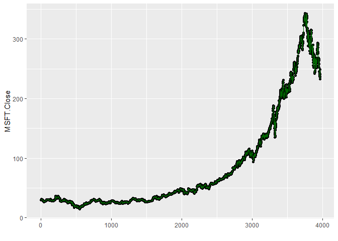
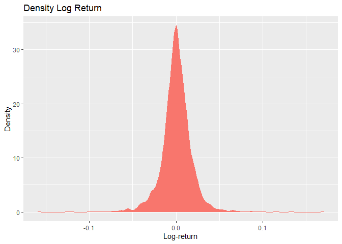
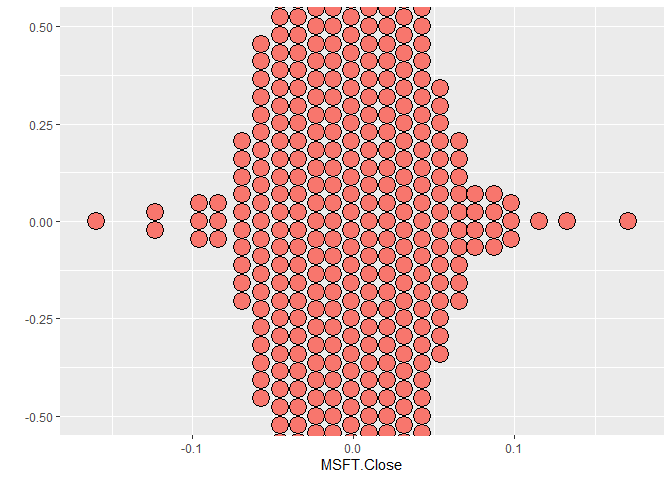

Shares price risk management with statistical approach
================
Ragdoll99
2022-09-26

## R Markdown

### This project is to showcase using statistical methods to analyze investment risk management in equity (in our case, Microsoft)

``` r
library(quantmod)
library(tidyverse)
library(dplyr)
library(ggplot2)
msft <- getSymbols("MSFT",src="yahoo",auto.assign=FALSE)
msft <- data.frame(msft)
head(msft, 5)
```

    ##            MSFT.Open MSFT.High MSFT.Low MSFT.Close MSFT.Volume MSFT.Adjusted
    ## 2007-01-03     29.91     30.25    29.40      29.86    76935100      21.68803
    ## 2007-01-04     29.70     29.97    29.44      29.81    45774500      21.65170
    ## 2007-01-05     29.63     29.75    29.45      29.64    44607200      21.52823
    ## 2007-01-08     29.65     30.10    29.53      29.93    50220200      21.73887
    ## 2007-01-09     30.00     30.18    29.73      29.96    44636600      21.76065

Keep only the closing price for each day

``` r
msft_close <- dplyr::select(msft, "MSFT.Close")
tail(msft_close, 5)
```

    ##            MSFT.Close
    ## 2022-09-20     242.45
    ## 2022-09-21     238.95
    ## 2022-09-22     240.98
    ## 2022-09-23     237.92
    ## 2022-09-26     237.45

### Let calculate log return for each day.

log return is calculated by taking the natural log of the ending value
divided by the beginning value  
in time series analysis, we use log-return for each period because it is
time-additive/ time-consistence  
daily log return sum up will equal to period return, hence it is widely
used by finance professionals  

``` r
qplot(data = msft_close,y = MSFT.Close)+geom_line(color='darkgreen')
```





``` r
msft_close <- as.matrix(msft_close)
logret <- diff(log(msft_close))
round(tail(logret,5),6)  
```

    ##            MSFT.Close
    ## 2022-09-20  -0.008502
    ## 2022-09-21  -0.014541
    ## 2022-09-22   0.008460
    ## 2022-09-23  -0.012779
    ## 2022-09-26  -0.001977

As contrast, below are the daily discrete returns

``` r
ret <- exp(logret) - 1         # calculate discrete return
round(tail(ret,5),6)
```

    ##            MSFT.Close
    ## 2022-09-20  -0.008466
    ## 2022-09-21  -0.014436
    ## 2022-09-22   0.008495
    ## 2022-09-23  -0.012698
    ## 2022-09-26  -0.001975

We can also calculating longer horizon log-returns and discrete
returns  
Weekly, monthly, quarterly and yearly log-returns  

``` r
# Calculating longer horizon log return
logret.w <- apply.weekly(logret,sum)
logret.m <- apply.monthly(logret,sum)
logret.q <- apply.quarterly(logret,sum)
logret.y <- apply.yearly(logret,sum)
# Calculating longer horizon discrete return
ret.w <- exp(logret.w)-1
ret.m <- exp(logret.m)-1
ret.q <- exp(logret.q)-1
ret.y <- exp(logret.y)-1
```

Let see the yearly return.  

``` r
round(tail(logret.y,5),6)
```

    ##            MSFT.Close
    ## 2018-12-31   0.171764
    ## 2019-12-31   0.439946
    ## 2020-12-31   0.343873
    ## 2021-12-31   0.413496
    ## 2022-09-26  -0.348106

### Value at Risk

Next, we calculate mean and standard deviation of logreturn so that we
can derive Value-at-Risk (VaR)  

``` r
mu <- mean(logret)
sig <- sd(logret)
mean_sd <- list(round(mu, 6 ), round(sig,6 ))
names(mean_sd) <- c("Mean", "SD")
mean_sd
```

    ## $Mean
    ## [1] 0.000524
    ## 
    ## $SD
    ## [1] 0.01784

Calculating the VaR of normal distribution  
Let use 5% quartile of the probability density function  
alpha = 0.05, time period = 1 day  
What is the 1 day VaR at 95% confidence level of the portfolio  
Assume that we invested U\$10,000 into the Microsoft  

``` r
var <- qnorm(0.05,mu,sig)
HFvar <- 10000 * (exp(var)-1 )  # in US dollars
round(HFvar, 2)
```

    ## [1] -284.09

What doest this mean? It simply mean that over 1 day, your investment is
not likely to lose more than U\$284.12 dollar at 95% of confidence
level.  

### Expected shortfall 

Expected shortfall - Expected shortfall is the expected return given
that the return is worse than the associate VaR.  
In other word, it is the average of return(loss) in the situtaion where
the stock price went lower than VaR.  
Let try to calculate ES based on the same probability level (1-alpha)  

``` r
es <- mu-sig*dnorm(qnorm(0.05,0,1),0,1)/0.05
ES <- 10000 * ( exp(es)-1 ) # in millions of dollars
round(es, 6)
```

    ## [1] -0.036275

If MSFT share price fall more than the VaR, our investment portfolio is
expected to lose 3.6% which is around U\$360 dollar (follow normal
distribution)  

What would happened if the return is not in normal distribution? Let’s
explore whether our logreturn is in normal distribution  

<!-- -->
very interesting density plot, look

    ## Bin width defaults to 1/30 of the range of the data. Pick better value with `binwidth`.

<!-- -->

### Let generate same length of normal distribution and do a comparison: 

    ##              MSFT.Close Norm.Distribution
    ## 2007-01-04 -0.001675951      0.0198750268
    ## 2007-01-05 -0.005719107     -0.0002130422
    ## 2007-01-08  0.009736555      0.0194250223
    ## 2007-01-09  0.001001803      0.0186463481
    ## 2007-01-10 -0.010063789      0.0212977437
    ## 2007-01-11  0.034463350      0.0158951687

    ##         values        ind
    ## 1 -0.001675951 MSFT.Close
    ## 2 -0.005719107 MSFT.Close
    ## 3  0.009736555 MSFT.Close
    ## 4  0.001001803 MSFT.Close
    ## 5 -0.010063789 MSFT.Close
    ## 6  0.034463350 MSFT.Close

<!-- -->
Let do some check for log-return  

### Skewness check 

Rule of thumb is that if the coefficient of skewness is 0
(data=sysmetric), -ve(left-skewed), +ve(right-skewed)  

``` r
library(moments)
rvec <- as.vector(logret)
round(skewness(rvec),2)
```

    ## [1] 0

from this test, we noted that our logreturn is sysmetric  
Let check if the tail of log-return is thin-tailed or heavy-tailed  

### Kurtosis test 

Rule of thumb is that the test score is 3 (normal), \<3 (thin-tailed),
\>3 (heavy-tailed)  
A distribution with a kurtosis greater than 3 has more returns out in
its tails than the normal  

``` r
round(kurtosis(rvec),2)
```

    ## [1] 12.17

### Lastly, let try Jarque-Bera test 

Jarque-Bera test: test for normality, It is used for determining whether
a given dataset has skewness and kurtosis that matches normality.  
\### Jarque Bera is formulated as follows:  
$JB = \frac{n}{6} \left( S^{2} + \frac{1}{4} (K-3)^{2} \right)$  
where, n = number of observations in a sample k = number of regressors S
= skewness of the sample  
if p value less than alpha, reject null hypothesis (normal
distribution)  

``` r
jarque.test(rvec)
```

    ## 
    ##  Jarque-Bera Normality Test
    ## 
    ## data:  rvec
    ## JB = 13877, p-value < 2.2e-16
    ## alternative hypothesis: greater

since p value is less than alpha, we hence reject that normality in
log-return  
Data is sysmetric yet heavy-tailed.  

### Student t-distribution simulation 

Let’s use T-test (or student t-test) for simulation  

$t=\frac{m-\mu}{s / \sqrt{n}}$  

Using a fitdistr function, we can calculate the  
Maximum-likelihood fitting of univariate distributions, allowing
parameters to be held fixed if desired.  

``` r
library(MASS)
```

    ## 
    ## Attaching package: 'MASS'

    ## The following object is masked from 'package:dplyr':
    ## 
    ##     select

``` r
rvec <- as.vector(logret)
t.fit <- fitdistr(rvec, "t")
round(t.fit$estimate,6)
```

    ##        m        s       df 
    ## 0.000663 0.011147 3.070547

``` r
alpha <- 0.05
RNGkind(sample.kind='Rounding')
set.seed(123789)
library(metRology)
rvec <- rt.scaled(100000,mean=t.fit$estimate[1],sd=t.fit$estimate[2],df=t.fit$estimate[3])
VaR <- quantile(rvec,alpha)
ES <- mean(rvec[rvec<VaR])
```

VaR when using student t-test simulation

``` r
round(VaR,6)
```

    ##        5% 
    ## -0.025181

Expected shortfall with studetn t-test simulation

``` r
round(ES,6)
```

    ## [1] -0.041086

The more accurate risk following a t-test simulation as below:

``` r
10000 * VaR
```

    ##        5% 
    ## -251.8101

What doest this mean? It simply mean that over 1 day, if the logreturn
are following t-test simulation,  
your investment is not likely to lose more than U\$252.49 dollar at 95%
of confidence level. This is lower than simulating using historical data
from logreturn

``` r
ES
```

    ## [1] -0.04108598

However, in term of expected shortfall, noted that it is now 4% which is
higher than previously calculated 3.6%, likely due to its heavy-tailed
distribution.
